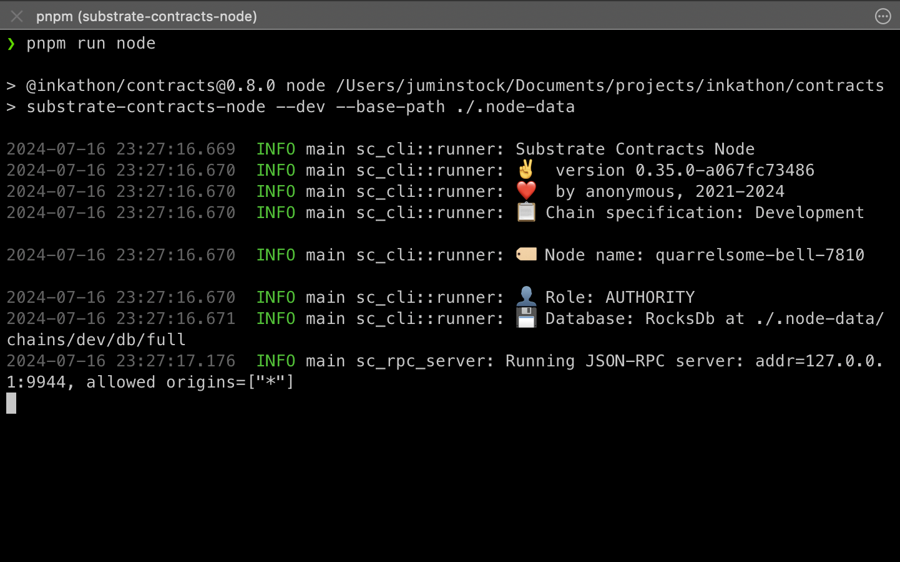
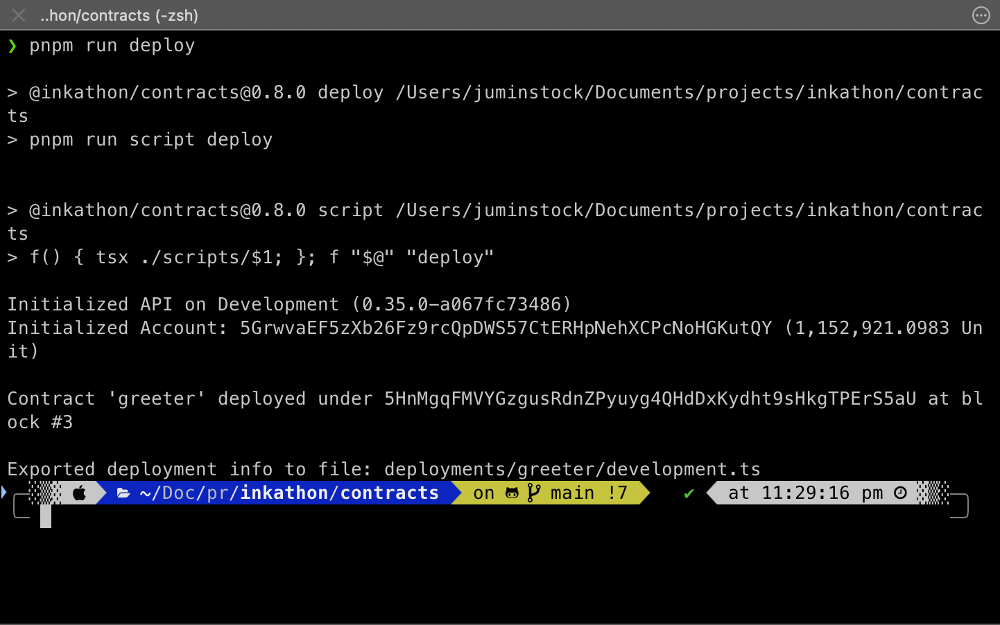

# Crea un proyecto con ink!athon


## Getting Started
Con esta guía técnica aprenderás a cómo crear, configurar y deployar un proyecto completo de ink! usando ink!athon, el Full-stack DApp boilerplate para Substrate y smart contracts construídos con ink!. Esta guía está enfocada en developers nuevos en el ecosistema de Polkadot o que no hayan usado antes la herramienta de ink!athon. ¡Empecemos! 

## Pre-requisitos
Para llevar a cabo con éxito esta guía técnica, deberás realizar las siguientes acciones necesarias:
- Instalar [Node.js](https://nodejs.org/en) v18+ (es recomendado hacerlo vía [nvm](https://github.com/nvm-sh/nvm) usando `nvm install 18`)
- Instalar [pnpm](https://pnpm.io/installation) (es recomendado instalarlo vía Node.js Corepack o usando `npm i -g pnpm`)
- Clonar el repositorio de ink!athon [aquí](https://github.com/scio-labs/inkathon)
- Instalar Rust y sus toolchains (usa esta [guía de Substrate](https://docs.substrate.io/install/))
- Instalar cargo contract (usa esta [guía de Parity](https://github.com/use-ink/cargo-contract))
- Instalar un nodo local de desarrollo (opcional, puedes usar [swanky-node](https://github.com/inkdevhub/swanky-node) o [substrate-node](https://github.com/paritytech/substrate-contracts-node)) 

## Construir el proyecto

### 1. Clonar el repositorio
Lo primero que debes hacer es clonar el repositorio, hazlo en tu terminal con este comando:

```bash
git clone git@github.com:scio-labs/inkathon.git
```

Esto generará una carpeta con todos los archivos provenientes del repositorio de GitHub. Ahora deberás posicionarte dentro de la carpeta y para ello, ejecuta este comando:

```bash
cd inkathon
```

### 2. Instalar dependencias
Instala las dependencias del proyecto y ejecuta el frontend con los siguientes comandos:

```bash title="/inkathon"
# Instala dependencias (una vez)
# NOTA: Esto automáticamente crea un archivo `.env.local`
pnpm install
```
```bash title="/inkathon"
# Inicia el proyecto de Next.js
pnpm run dev
```

### 3. Construir y deployar contratos
El repositorio trae consigo un smart contract plantilla para testing, pasa a compilarlo y deployarlo con los siguientes comandos:

```bash title="/inkathon"
cd contracts
```

```bash title="/inkathon/contracts"
pnpm run build
```

Luego, puedes iniciar un nodo local para desarrollo. El proyecto de ink!athon trae uno consigo al momento de clonar el repositorio, o sencillamente podrías usar uno de los que descargaste externamente. Usemos el [substrate-node](https://github.com/paritytech/substrate-contracts-node) que trae ink!athon. Para usarlo solo debes correr el siguiente comando:

```bash
pnpm run node
```

El output se debería ver de esta manera:



Finalmente, pasemos a deployar el contrato a través del siguiente comando:

```bash
pnpm run deploy
```

Si todo ocurrió con éxito, verás esta información en tu terminal:



:::note

Ten presente que el deploy del contrato lo hicimos en el nodo local de `substrate-node`, para hacerlo en otra red puedes pasar la flag `CHAIN` en la línea de comandos al momento de deployar de esta manera: `CHAIN=alephzero-testnet pnpm run deploy`

:::

